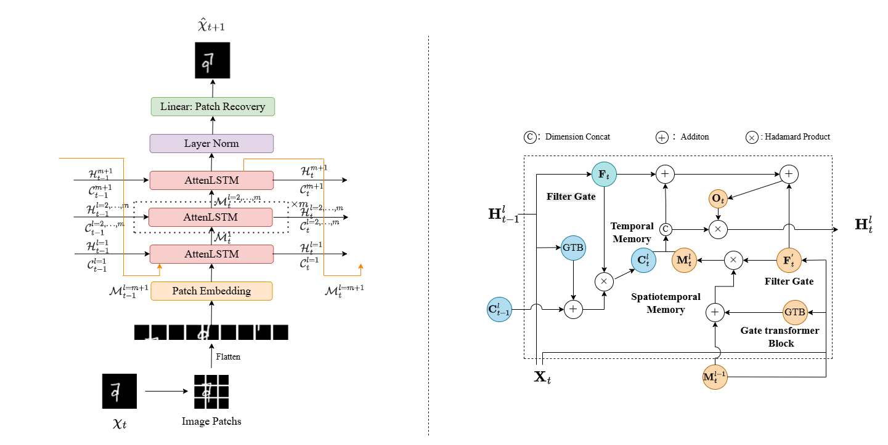

# GAttenRNN: A Novel Recurrent Neural Network with Gated Transformer for Enhanced spati-temporal Prediction
    The current research results have been submitted and are currently under review.
    https://zenodo.org/badge/DOI/10.5281/zenodo.16813327.svg
## Introduction

Spati-temporal prediction, pivotal in diverse applications such as autonomous driving and traffic flow forecasting, faces challenges in capturing complex spati-temporal dependencies. Traditional CNN-based models are limited by narrow receptive fields, hindering their efficiency. To address this, we introduce GAttenRNN, a recurrent neural network incorporating a gated Transformer module and a simplified LSTM network. This design replaces convolutional structures with self-attention augmented by gating mechanisms, enabling global feature extraction and bidirectional memory flow across hierarchical layers. Experimental results on Moving MNIST, TaxiBJ, and KTH datasets demonstrate GAttenRNN's superior performance, achieving significant reductions in Mean Squared Error (MSE) compared to state-of-the-art models. This work highlights the potential of integrating Vision Transformers into RNN frameworks for effective spati-temporal learning without relying on complex model architectures.
## Overview
- `arg_setting/` used to parse configuration files for spatio-temporal sequence-related tasks and generate a unified setting dictionary for the model training, validation, and testing processes.
- `configs/` YAML configuration file providing data.
- `datasets/` PyTorch Lightning data module for building datasets.
- `models/` an AttenRNN model that combines attention mechanism and recurrent neural network is implemented.
- `task/` predict and evaluate the prediction performance of different types of spatiotemporal data.
- `utils/` spati-temporal data processing and visualization.
- `test_w.py` testing models trained based on the PyTorch Lightning framework.
- `train_w.py` a general framework for training models.
## Requirements
- python >= 3.8
- pytorch: 1.10.0+
- pytorch-lightning: 1.6.0+
- numpy: 1.21.0+
- pandas: 1.3.0+
- einops: 0.4.0+
- torchvision: 0.11.0+
- matplotlib: 3.5.0+
- scikit-image: 0.19.0+
- tqdm: 4.62.0+
- torchmetrics: 0.7.0+
## Train
    python train_w.py /GAttenRNN/configs/taxibj/AttenRNN/AttenRNN11M/seed=42.yaml
## Test
    python test_w.py path/to/setting.yaml
## Citation
